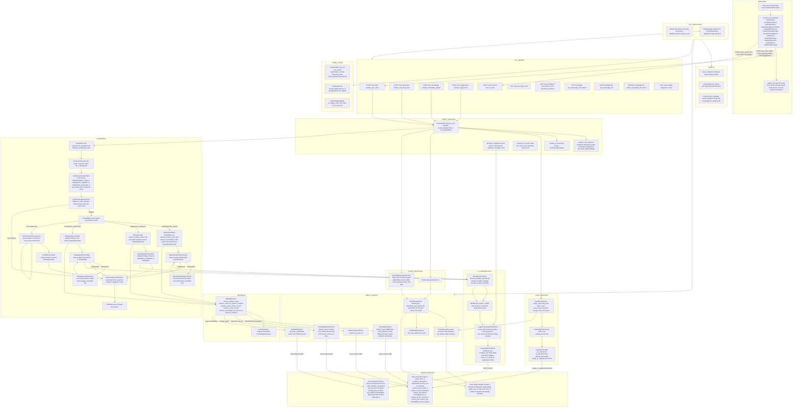

```mermaid
flowchart TD

  subgraph FRONTEND
    HTML[index.html 5-panel SPA Case Board AI KPIs Admin]
    JS[cosolve-ui.js caseState hydrateCase normalizeCaseDoc setPhaseStatus updateNavStatusForPhase updateWfDurations checkDueDateOverdue refreshKnowledgeList sortKbDocs sendFullEnvelope submitAiQuestion renderKbDocs buildEntryEnvelope]
    CSS[styles.css d-tab sec-head btn-confirm-inline kpi-panel-body d1-two-col date-overdue d-duration]
    HTML --> JS
    JS --> CSS
  end

  subgraph API_ROUTES
    R1[POST entry case handle_case_entry]
    R2[POST entry reasoning handle_reasoning_entry]
    R3[POST entry knowledge handle_knowledge_upload]
    R4[POST entry suggestions handle_suggestions]
    R5[POST cases search search_cases]
    R6[GET cases by id get_case]
    R7[GET cases evidence list_evidence and download_evidence]
    R8[GET knowledge list_knowledge_documents]
    R9[GET knowledge file get_knowledge_file]
    R10[DELETE knowledge file delete_knowledge_document]
    R11[GET cases debug diagnostic routes]
  end

  subgraph ENTRY_HANDLER
    EH[EntryHandler handle_entry dispatch CASE_INGESTION or AI_REASONING]
    EH_CASE[handle_case_ingestion CREATE UPDATE CLOSE UPLOAD_EVIDENCE UPLOAD_KNOWLEDGE]
    EH_AI[handle_ai_reasoning invoke UnifiedIncidentGraph]
    EH_SUGG[generate_suggestions 6 AI chips 2 operational 2 similarity 1 strategy 1 KPI]
    EH_STATS[compute_llm_stats reads llm_calls.jsonl node times tokens cost]
    EH --> EH_CASE
    EH --> EH_AI
  end

  subgraph CASE_SERVICES
    CES[CaseEntryService create_case load_case patch_case save_case_document merge_case_document]
    CIS[CaseIngestionService index case upload_documents]
    CSI[CaseSearchIndex get_document try_get_document upload_documents merge_or_upload_documents]
    CES --> CIS
    CIS --> CSI
  end

  subgraph OTHER_INGESTION
    EIS[EvidenceIngestionService]
    KIS[KnowledgeIngestionService PDF extract PyPDF2 pypdf pdfplumber chunk 12000 chars upload to index and blob]
  end

  subgraph LANGGRAPH
    N_START[StartNode reset operational_escalated and strategy_escalated to false]
    N_CTX[ContextNode load case detect current D-state D1_2 through D8]
    N_CLS[IntentClassificationNode LLM classify OPERATIONAL_CASE or SIMILARITY_SEARCH or STRATEGY_ANALYSIS or KPI_ANALYSIS confidence score]
    N_QR[QuestionReadinessNode READY or NOT_READY deterministic rules plus LLM check]
    N_RT[RouterNode route equals classification intent]
    N_OP[OperationalNode HybridRetriever retrieve_similar_cases and retrieve_knowledge LLM 3-pass reasoning returns OperationalPayload]
    N_OPR[OperationalReflectionNode assess quality ESCALATE or CONTINUE]
    N_OPE[OperationalEscalationNode rerun with premium model sets operational_escalated true]
    N_SIM[SimilarityNode retrieve_similar_cases LLM precedent analysis returns SimilarityPayload]
    N_SIMR[SimilarityReflectionNode validate findings check for MISSING or FORCED or GENERIC]
    N_STR[StrategyNode portfolio pattern analysis LLM returns StrategyPayload]
    N_STRR[StrategyReflectionNode assess depth ESCALATE or CONTINUE]
    N_STRE[StrategyEscalationNode rerun with premium model sets strategy_escalated true]
    N_KPI[KPINode KPITool get_kpis scope global or country or case returns KPIResult]
    N_KPIR[KPIReflectionNode interpret metrics returns KPIInterpretation]
    N_FMT[ResponseFormatterNode synthesize final_response citations suggestion chips]
    N_END[EndNode pass-through termination]

    N_START --> N_CTX --> N_CLS --> N_QR
    N_QR -->|READY| N_RT
    N_QR -->|NOT READY| N_FMT
    N_RT -->|OPERATIONAL_CASE| N_OP
    N_RT -->|SIMILARITY_SEARCH| N_SIM
    N_RT -->|STRATEGY_ANALYSIS| N_STR
    N_RT -->|KPI_ANALYSIS| N_KPI
    N_OP --> N_OPR
    N_OPR -->|ESCALATE| N_OPE --> N_OPR
    N_OPR -->|CONTINUE| N_FMT
    N_SIM --> N_SIMR --> N_FMT
    N_STR --> N_STRR
    N_STRR -->|ESCALATE| N_STRE --> N_STRR
    N_STRR -->|CONTINUE| N_FMT
    N_KPI --> N_KPIR --> N_FMT
    N_FMT --> N_END
  end

  subgraph AI_CONTROLLERS
    EC[EscalationController should_escalate_operational should_escalate_strategy should_escalate_similarity]
    MP[ModelPolicy resolve_model returns base or premium deployment name]
    LMC[LanguageModelClient complete_json complete_text SDK mode with REST fallback coerce_to_model on malformed JSON]
    LLMC[LoggedLanguageModelClient wraps LMC timing and token tracking writes to llm_calls.jsonl 365-day rolling window]
    EC --> MP --> LLMC --> LMC
  end

  subgraph RETRIEVAL
    HR[HybridRetriever retrieve_similar_cases retrieve_cases_for_pattern_analysis retrieve_active_cases_for_kpi retrieve_cases_for_kpi retrieve_knowledge min_score 0.5 retrieve_evidence]
    RM[CaseSummary EvidenceSummary KnowledgeSummary]
    HR --> RM
  end

  subgraph INFRA_CLIENTS
    CSC[CaseSearchClient hybrid_search BM25 plus vector filtered_search OData only text_search wildcard and simple]
    ESC[EvidenceSearchClient search_by_case_id]
    KSC[KnowledgeSearchClient hybrid_search 2-stage score small_chunks then fetch parent_section_id docs]
    EMB[EmbeddingClient generate_embedding returns list of float lazy init]
    BSC[BlobStorageClient upload_json download_json upload_file download_file list_files delete_file exists]
    CR[CaseRepository create load save add_evidence list_evidence get_evidence]
    CRR[CaseReadRepository list_case_paths load_case]
    BSC --> CR
    BSC --> CRR
  end

  subgraph AZURE_SERVICES
    AZAI[Azure AI Search Index 1 cases case_id problem_description organization actions_text ai_summary content_vector Index 2 evidence case_id filename content_text Index 3 knowledge doc_id parent_section_id source chunk_type content_text embedding cosolve_phase]
    AZOAI[Azure OpenAI Foundry keys Chat deployments per node classifier operational plus premium similarity strategy plus premium kpi_reflection Embedding deployment API version 2024-10-21]
    AZBLOB[Azure Blob Storage Container AZURE_STORAGE_CONTAINER paths case_id case.json case_id evidence filename knowledge filename]
  end

  subgraph STATE_LAYER
    IS[IncidentState case_id case_status organization_country reasoning_state from_payload classmethod]
    IF[IncidentFactory create_empty sets D1_2 through D8 to not_started]
    ISA[IncidentStateAdapter to_legacy_case_doc maps D1_2 to D1_D2]
  end

  subgraph CONFIG
    CFGAZ[Azure endpoints and keys Search OpenAI Blob]
    CFGLLM[LLM deployment names per node plus premium tiers]
    CFGRET[Retrieval top_k defaults similar 5 pattern 20 kpi 100 knowledge 10 evidence 20]
  end

  subgraph APP_BOOTSTRAP
    BC[BackendContainer DI wiring all services validate_search_indexes_exist]
    BA[BackendApp FastAPI init CORS ApiRoutes registration app exported]
    BC --> BA
  end

  JS -->|POST entry case POST entry reasoning POST entry suggestions| R1
  JS -->|POST cases search GET cases GET knowledge| R5
  R1 --> EH
  R2 --> EH
  R3 --> EH
  R4 --> EH
  EH --> CES
  EH --> EIS
  EH --> KIS
  EH --> N_START
  EH_SUGG --> LLMC

  N_OP --> HR
  N_SIM --> HR
  N_STR --> HR
  N_KPI --> N_KPI

  HR -->|hybrid filtered text search| CSC
  HR -->|search by case_id| ESC
  HR -->|2-stage hybrid| KSC
  HR -->|query embedding| EMB

  N_OPR --> EC
  N_STRR --> EC
  N_SIMR --> EC
  EC --> MP

  CSC -->|Azure Search SDK| AZAI
  ESC -->|Azure Search SDK| AZAI
  KSC -->|Azure Search SDK| AZAI
  CSI -->|merge_or_upload_documents| AZAI

  EMB -->|Azure OpenAI SDK| AZOAI
  LMC -->|REST or SDK| AZOAI

  CES --> CR
  KIS --> BSC
  EIS --> BSC
  CR --> AZBLOB
  BSC --> AZBLOB

  APP_BOOTSTRAP --> CONFIG
  APP_BOOTSTRAP --> INFRA_CLIENTS
  APP_BOOTSTRAP --> STATE_LAYER
  APP_BOOTSTRAP --> API_ROUTES
```